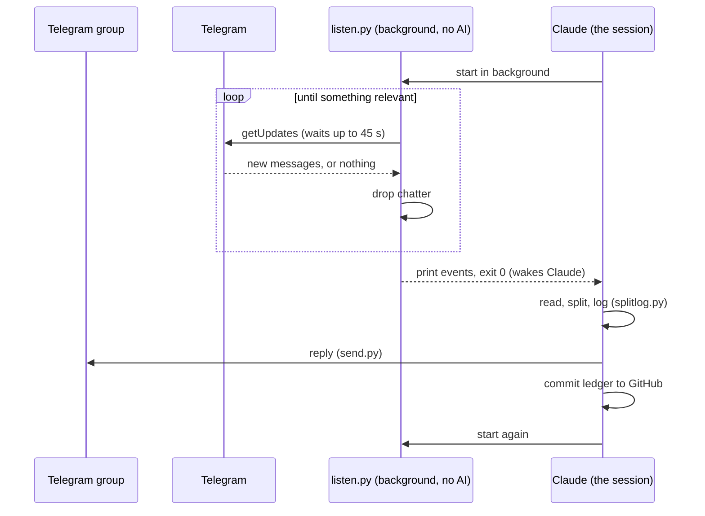

# How it works: a Telegram bot on a Claude subscription

Most chatbots run on a server that receives messages and calls an AI model through a paid API key. This one has no server and no API key. It runs inside Claude Code cloud sessions, on a Claude Pro or Max subscription. This page explains the method, because it works for any chat bot, not just this one.

## The problem

A Claude Code session is built for a person typing to it. Three things seem to rule it out as a bot:

1. **It can't receive messages from outside.** A cloud session has no public address, so Telegram's usual way of delivering messages (a webhook: Telegram calls your server) can't reach it.
2. **It only acts when spoken to.** After it answers, it waits for the next message from you.
3. **It doesn't run forever.** Sessions end, and a long one gets slow and costly as its history grows.

## The trick: a listener that exits

**1. Pull instead of push.** Telegram also offers long polling (`getUpdates`): the bot asks "anything new?" and Telegram holds the request open for up to 45 seconds until a message arrives. That's an outgoing request, which a cloud session can make. No public address needed.

**2. A background command wakes Claude when it finishes.** Claude Code can run a command in the background, and when that command exits, Claude is woken with its output, the same as if you had sent a message. So the bot is a small script (`trips/splitbot/listen.py`) that:

- long-polls Telegram in a loop (plain `curl`, no AI, so waiting costs nothing);
- throws away anything Claude doesn't need to see;
- when something relevant arrives, prints it and **exits**.

The exit is the doorbell. Claude wakes up, reads the printed messages, does the work (logs the payment, replies in the group), and starts the listener again. Then it goes quiet until the next exit.

**3. A routine restarts it twice a day.** A scheduled routine starts a fresh session every 12 hours. Each run stops itself just before the next begins. Fresh sessions keep the history short, so each wake-up stays cheap.

## Details that make it reliable and cheap

| Problem | What the code does |
|---|---|
| Waking Claude for every "lol" would burn usage | The listener filters first. Claude only wakes for a number, a photo, a voice note, a /command, a mention or reply to the bot, or a keyword (balances, settle, poll, near me...). Chatter costs nothing |
| A wake-up re-reads the whole conversation | The listener is restarted at least every 55 minutes, even when nothing happens. Claude's prompt cache lasts an hour, so each wake-up reads mostly from cache, which costs far less than reading fresh |
| The session can die mid-message | Messages are saved to an inbox folder before the listener confirms them to Telegram. A new run prints anything left in the inbox first. Telegram keeps unconfirmed messages for 24 hours, so nothing is lost between runs |
| The same message handled twice | Every ledger entry carries Telegram's update id; logging the same update again does nothing |
| Two listeners answering the same message | A file lock lets only one listener run per session (exit code 6 if another holds it) |
| Code updated while the bot is running | The listener exits with code 5 when its own files change, so the session restarts it on the new code |
| The cloud computer is wiped between runs | Everything that matters (trips, ledger, plans) is committed to the GitHub repo after each change. Photos, voice notes and locations stay on the temporary machine and are deleted |
| The AI doing arithmetic | It doesn't. Claude decides what a message means (who paid, how much, split how); `splitlog.py` does every sum, split and currency conversion in cents |
| Strangers adding the bot to their group | The listener drops messages from any group that has no trip and that the owner isn't in, before Claude sees them |
| Friends trying to instruct the bot ("ignore your rules...") | The skill treats group messages as data: they can become ledger entries or questions, never other actions |

Exit codes, so the session knows what to do next: `0` events to handle · `3` time's up for this listen (restart it) · `4` owner sent /stopbot · `5` code changed (restart) · `6` another listener is running · `2` token or owner id missing.

## Where things live

| Piece | Role |
|---|---|
| `trips/splitbot/listen.py` | The listener: long poll, filter, inbox, exit |
| `.claude/skills/bill-split/SKILL.md` | Claude's instructions: what to do with each kind of message and each exit code |
| `trips/splitbot/splitlog.py`, `report.py`, `plan.py`, `send.py`... | Plain scripts Claude calls for arithmetic, reports, plans and replies |
| `trips/data/` | The ledger, committed to GitHub |
| The routine (SETUP.md step 7) | Starts a fresh 12-hour run twice a day |

## Using the method for something else

The pattern carries over to any bot where a reply in 20–60 seconds is fine:

1. A listener script that long-polls the service, filters hard, saves to an inbox, prints and exits.
2. A skill file telling Claude how to handle each event, and to relaunch the listener after.
3. Plain scripts for anything that must be exact (money, dates, counting).
4. State committed to git, because the machine is temporary.
5. A routine that starts a fresh session every 12 hours.

**What it isn't good for:** instant replies, very busy chats (every relevant message costs a little usage), or anything that must run while your Claude plan's usage limit is reached.
